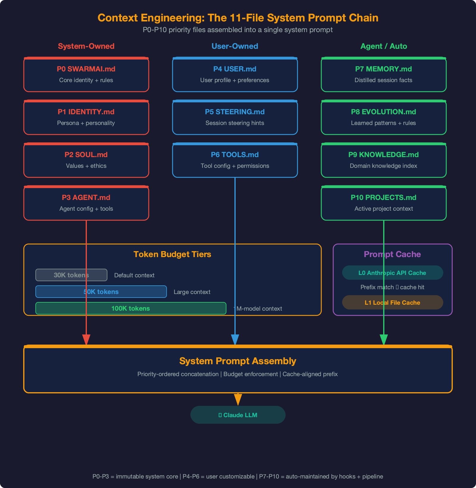
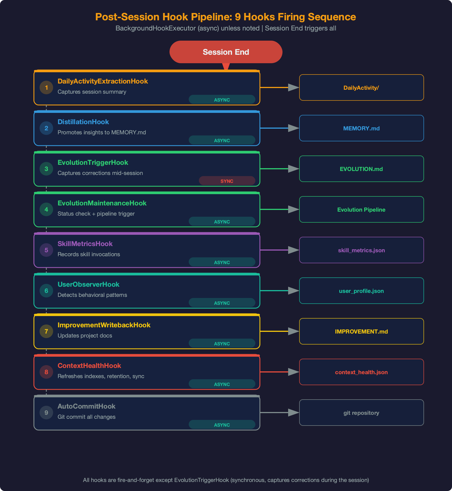
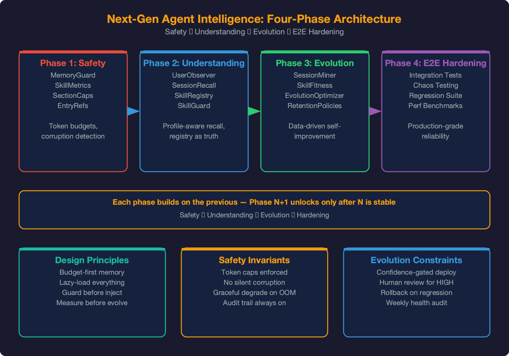
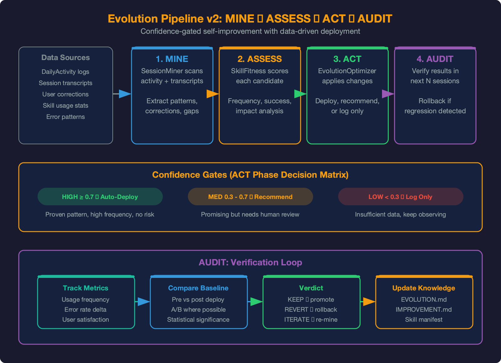
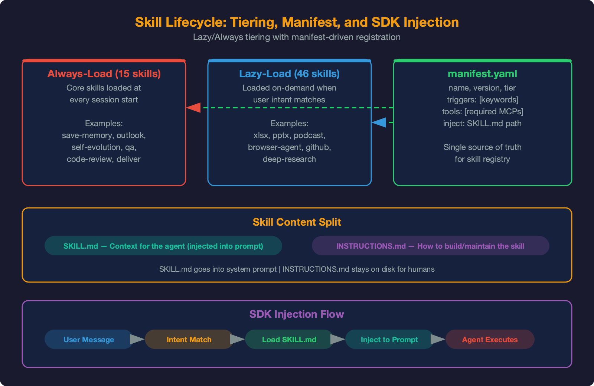
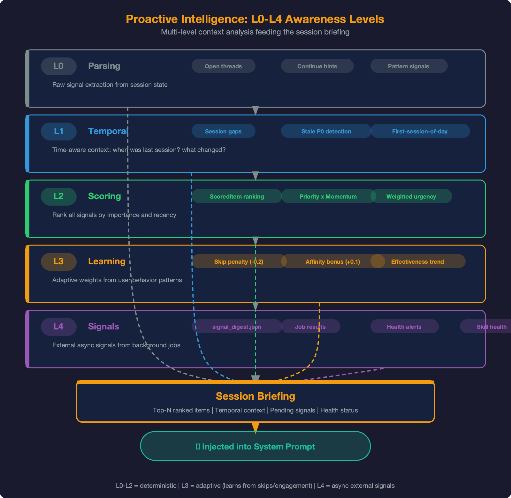

# Self-Evolution Harness

## Executive Summary

Most AI tools reset when you close them. Context is lost, decisions are forgotten, and users re-explain the same things session after session. SwarmAI solves this structurally --- not through fine-tuning, but through an engineered **harness** that wraps a stateless LLM (Claude via Bedrock Agent SDK) and transforms it into a persistent, evolving agent.

The harness is the core innovation. It provides:

- **Context continuity** --- an 11-file priority chain (P0--P10) assembled into every system prompt with token budget management and multi-tier caching
- **Memory persistence** --- a 3-layer distillation pipeline (capture -> distill -> curate) with hybrid vector+keyword recall across 1,000K+ tokens of accumulated knowledge
- **Self-evolution** --- a 4-phase pipeline (MINE -> ASSESS -> ACT -> AUDIT) that mines user corrections from 1,500+ session transcripts and autonomously improves underperforming skills
- **Proactive intelligence** --- 5-level session briefing (L0--L4) with cross-session learning and external signal integration
- **Safety** --- 7 defense-in-depth layers from tool logging to decision classification
- **Compound growth** --- 8 post-session hooks that create a flywheel where every session makes the next one better

**Key metrics (April 2026):**

| Metric | Value |
|--------|-------|
| Harness modules | 28 files, 14,500+ lines |
| Post-session hooks | 9 (all async via BackgroundHookExecutor except 1 synchronous) |
| Context files | 11 (P0--P10 priority chain) |
| Token budget tiers | 3 (30K default, 50K large, 100K for 1M-context models) |
| Skills | 61 (15 always-loaded, 46 lazy-loaded) |
| Evolution pipeline | 4-phase MINE -> ASSESS -> ACT -> AUDIT, confidence-gated |
| Proactive intelligence | 5 levels (L0 parsing -> L4 external signals), 1,149 lines |
| Safety layers | 7 defense-in-depth |
| Commits | 838+ |

**Design principle:** Power over token budget. Every design maximizes recall and capability --- never optimizes for token savings. SwarmAI has a 1M context window; the primary goal is powerful function.

---

## 1. The Harness Concept

### 1.1 Problem: Stateless LLMs Forget Everything

Claude is stateless. Every API call starts fresh --- no memory of prior sessions, no awareness of user preferences, no learning from past mistakes. The Agent SDK adds tool use and conversation threading within a session, but cross-session continuity is zero.

This creates three failure modes:

| Failure | User Experience | Structural Cause |
|---------|----------------|------------------|
| **Amnesia** | "We discussed this last week..." | No cross-session memory |
| **Regression** | "You made this same mistake before..." | Corrections not persisted |
| **Blindness** | "Check the design doc we wrote..." | Accumulated knowledge invisible |

### 1.2 Solution: The Harness

The harness is a structured engineering layer between the user interface and the raw LLM:

```
User -> Interface -> [HARNESS] -> Claude Agent SDK -> Bedrock API
                         |
              Context Engineering (11 files)
              Memory Pipeline (distill + recall)
              Self-Evolution (mine + optimize)
              Proactive Intelligence (L0-L4)
              Post-Session Hooks (9 hooks)
              Safety (7 layers)
```

Every component in the harness serves one purpose: **make the next session better than the current one.** This is the compound loop.

### 1.3 The Compound Loop


The defining characteristic is the feedback cycle where every session's output becomes the next session's input:

1. **Session executes** --- user interacts, decisions are made, code is written
2. **Hooks fire** --- 9 post-session hooks capture everything relevant
3. **Memory distills** --- DailyActivity accumulates; distillation promotes to MEMORY.md
4. **Evolution runs** --- corrections mined from transcripts; skills improved autonomously
5. **Context enriched** --- next system prompt assembled from updated 11-file chain
6. **Agent is smarter** --- next session starts with full awareness of everything that happened

This is not aspirational --- it is implemented and production-wired. Every hook, every pipeline stage, every injection point described in this document is shipped code.

---

## 2. Context Engineering



### 2.1 The 11-File Priority Chain

Most AI tools assemble a single system prompt. SwarmAI maintains 11 files with strict priority ordering, ownership rules, and truncation policies.

**Implementation:** `core/context_directory_loader.py` (1,031 lines)

| Priority | File | Owner | Truncation |
|----------|------|-------|-----------|
| P0 | SWARMAI.md | System | Never |
| P1 | IDENTITY.md | System | Never |
| P2 | SOUL.md | System | Never |
| P3 | AGENT.md | System | Truncatable |
| P4 | USER.md | User | Truncatable |
| P5 | STEERING.md | User | Truncatable |
| P6 | TOOLS.md | User | Truncatable |
| P7 | MEMORY.md | Agent | Head-trimmed |
| P8 | EVOLUTION.md | Agent | Head-trimmed |
| P9 | KNOWLEDGE.md | Auto | Truncatable |
| P10 | PROJECTS.md | Auto | Lowest priority |

**Ownership rules:**

- **System-owned** (P0--P3): Source of truth is `backend/context/`. Overwritten every startup. Runtime copies in `.context/` are transient.
- **User-owned** (P4--P6): Source of truth is `.context/`. Copy-only-if-missing from templates.
- **Agent-owned** (P7--P8): Source of truth is `.context/`. Agent writes via hooks and `locked_write.py` with flock protection.
- **Auto-generated** (P9--P10): Rebuilt from filesystem scans by ContextHealthHook.

### 2.2 Token Budget Management

**Implementation:** `context_directory_loader.py` lines 380--414

Three budget tiers based on model context window:

| Tier | Threshold | Budget | Models |
|------|-----------|--------|--------|
| Default | < 200K context | 30,000 tokens | Haiku, small models |
| Large | >= 200K context | 50,000 tokens | Sonnet |
| 1M | >= 500K context | 100,000 tokens | Claude 4.6 Opus/Sonnet (1M GA) |

**Priority truncation:** When assembled content exceeds budget, files are truncated from P10 upward. P0--P2 are never truncated (identity/safety). P7--P8 (MEMORY/EVOLUTION) use head-trimming --- oldest entries removed first, newest preserved.

**Session-type-aware loading:** Channel sessions skip files to reduce noise:

| Session Type | Excluded Files | Savings |
|-------------|----------------|---------|
| Group channels | MEMORY.md, USER.md | ~7K tokens |
| Non-owner DMs | EVOLUTION.md, PROJECTS.md | ~3.5K tokens |
| Owner DM / Chat tabs | Nothing excluded | Full context |

### 2.3 L0/L1 Caching

Two-tier caching prevents redundant assembly:

**L1 cache** (`L1_SYSTEM_PROMPTS.md`): Full concatenation of all 11 files. Freshness checked via:
1. **Primary:** `git status --porcelain` (15-second TTL) --- detects any `.context/` file changes
2. **Fallback:** File mtime comparison when git unavailable
3. **Budget header verification:** Cache rejected if stored budget tier doesn't match current model

**L0 cache** (`L0_SYSTEM_PROMPTS.md`): AI-summarized compact version for models with < 64K context window. Not used with Claude 4.6 (1M context).

**Methods:** `_is_l1_fresh()` -> `_is_l1_fresh_uncached()` -> `_load_l1_if_fresh()`

### 2.4 Resume Context Checkpoint

When a session crashes and resumes (via `--resume` flag), the agent needs to know what happened before the crash. Raw conversation history is 200K+ tokens --- injecting it all is wasteful and noisy.

**Solution:** A structured ~600-token checkpoint extracted mechanically (no LLM call):

```
Last request: "fix the credential chain bug"
Files touched: session_unit.py, context_directory_loader.py
Git commits: aca865b (fix: credential pre-flight)
Agent spawns: 1 (code-review)
Tool activity: 14 Read, 8 Edit, 3 Bash
Recent turns: [last 5 user/assistant exchanges]
```

**Implementation:** `build_resume_context()` in `context_injector.py`. Runs as an **independent step** outside the ContextDirectoryLoader try/except block --- this is critical. A previous Sev-2 (COE 2026-04-02) was caused by resume injection living inside a broad try block where an upstream zlib error silently skipped the injection.

---

## 3. Post-Session Hook Pipeline



### 3.1 Architecture

Every session close triggers 9 hooks via the `BackgroundHookExecutor`. All hooks are async (non-blocking the response path) except one synchronous mid-session hook.

**Implementation:** `hooks/` directory, wired via `SessionLifecycleHookManager`

| # | Hook | Lines | Output Target |
|---|------|-------|---------------|
| 1 | DailyActivity | 202 | DailyActivity/YYYY-MM-DD.md |
| 2 | Distillation | 1,568 | MEMORY.md (promoted entries) |
| 3 | EvolutionTrigger | 168 | EVOLUTION.md (corrections) |
| 4 | EvolutionMaintenance | 398 | Pipeline trigger + status |
| 5 | SkillMetrics | 291 | skill\_metrics SQLite table |
| 6 | UserObserver | 135 | user\_observations.jsonl |
| 7 | ImprovementWriteback | 351 | IMPROVEMENT.md |
| 8 | ContextHealth | 814 | Indexes, retention, sync |
| 9 | AutoCommit | 221 | Git commit |

**Total hook code:** 4,148 lines across 9 files.

### 3.2 Hook Execution Model

- **Executor:** `BackgroundHookExecutor` (async, serialized via `asyncio.Lock` for git-safe operations)
- **Never blocks** the response path --- hooks fire after the session response is complete
- **Exception isolation:** Each hook catches its own exceptions; one hook failure doesn't block others
- **Evolution trigger** is the exception --- `ToolFailureTracker` runs synchronously mid-session to detect repeated tool failures and emit nudges

### 3.3 What Each Hook Does

**DailyActivityExtractionHook** --- Captures the session's deliverables, decisions, lessons, git activity, files touched, and "next steps" into `DailyActivity/YYYY-MM-DD.md`. This is the raw material for distillation.

**DistillationHook** (1,568 lines --- the largest hook) --- When >= 3 unprocessed DailyActivity files accumulate, promotes recurring themes to MEMORY.md. Verifies implementation claims against `git log` before promoting (COE C005 fix). Enforces SectionCaps (KD: 30, LL: 25, COE: 15, RC: 30, OT: 10). Adds temporal metadata (`valid_from`, `superseded_by`).

**EvolutionTriggerHook** --- Detects user corrections ("don't X", "use Y instead") and competence demonstrations in real-time. Records to EVOLUTION.md corrections (C-entries) and competence (K-entries).

**EvolutionMaintenanceHook** --- Manages evolution cycle timing (7-day cadence). Triggers the MINE -> ASSESS -> ACT -> AUDIT pipeline when due.

**SkillMetricsHook** --- Scans messages for `Using Skill:` patterns. Detects correction patterns in subsequent user messages. Records to `skill_metrics` SQLite table. `get_evolution_candidates()` feeds the evolution pipeline.

**UserObserverHook** --- Extracts behavioral patterns: language preferences, domain expertise, communication style, workflow habits. Accumulates in `.context/user_observations.jsonl`. After 5+ converging observations, writes suggestions to `.context/user_suggestions.md` for system prompt injection.

**ImprovementWritebackHook** --- Writes session lessons and patterns to `Projects/SwarmAI/IMPROVEMENT.md` (the DDD document that tracks "have we tried this?").

**ContextHealthHook** (814 lines) --- Light check every session: file existence, format validation, index refresh. Deep check daily: DDD staleness detection, uncommitted work flags. Also triggers incremental sync for KnowledgeStore and TranscriptIndexer (see Memory Management doc).

**AutoCommitHook** --- Smart git commit with conventional commit messages. Only commits workspace changes (`.context/`, `Knowledge/`), never code changes without user approval.

---

## 4. Next-Gen Agent Intelligence --- 4-Phase System



The agent intelligence system is organized into 4 implementation phases, each delivering independently useful value. 19 modules, 9,026 lines, 291+ tests.

### 4.1 Phase 1: Safety + Observability

Build guardrails before automation.

| Module | Lines | Purpose |
|--------|-------|---------|
| **MemoryGuard** | 179 | Scan writes for secrets, injection, invisible chars |
| **SkillMetrics** | 468 | Track skill invocations + correction rates |
| **SectionCaps** | ~120 | Entry limits per MEMORY.md section |
| **EntryRefs** | ~80 | Cross-references with 1-hop loading |

**Key lesson:** MemoryGuard at the chokepoint (`locked_write.py`) catches most writes. But distillation, context health, and memory health jobs bypass the chokepoint with their own flock pattern. E2E review (Phase 4) found these 4 bypass paths and added inline `sanitize()` calls to each. A chokepoint audit must check every write path.

### 4.2 Phase 2: Understanding + Recall

Let the agent know the user and find relevant context.

| Module | Lines | Purpose |
|--------|-------|---------|
| **UserObserver** | 355 | Detect behavioral patterns, suggest USER.md updates |
| **SessionRecall** | 293 | FTS5 cross-session search, runs alongside keywords |
| **SkillRegistry** | 220 | Scan skills, read tier, generate compact index |
| **SkillGuard** | 164 | Trust-level security scanner for skill content |

### 4.3 Phase 3: Autonomous Evolution

Close the evolution loop.

| Module | Lines | Purpose |
|--------|-------|---------|
| **SessionMiner** | 580 | Mine 1,500+ JSONL transcripts for eval examples |
| **SkillFitness** | 156 | 3-signal scoring (Jaccard + bigram + containment) |
| **EvolutionOptimizer** | 1,410 | 4-phase pipeline, confidence-gated deployment |
| **RetentionPolicies** | ~120 | Time-based archival (90d/365d/7d thresholds) |

### 4.4 Phase 4: E2E Hardening

12 gaps found by comprehensive E2E review, all fixed:

| Severity | Count | Examples |
|----------|-------|---------|
| Critical | 3 | MemoryGuard bypass on 4 write paths; UserObserver dead-end output; SkillCreatorTool dead code |
| Important | 4 | SkillRegistry cache miss per build; transcript dir resolution; SkillGuard discovery gap; SessionRecall fallback-only |
| Low | 5 | SkillMetrics unused candidates; correction regex false positives; truncated agent actions |

**Key lesson:** 206 unit tests passed across all 3 phases, yet E2E review found 3 critical wiring gaps. Unit tests prove components work in isolation; only E2E caller -> callee trace proves they're wired into the system.

---

## 5. Evolution Pipeline v2 --- MINE -> ASSESS -> ACT -> AUDIT



The evolution cycle runs on a 7-day cadence (session-end hook trigger + Thursday cron fallback). Shipped April 12, 2026.

### 5.1 Phase 1: MINE

`SessionMiner.mine_all()` scans 1,500+ Claude Code JSONL transcripts:

1. For each skill, extract TRIGGER keywords from SKILL.md
2. Scan transcripts for sessions where the skill was invoked (tool names + keywords)
3. Two-stage filtering: keyword heuristic (cheap) -> relevance scoring (expensive, top candidates)
4. Extract: `{user_prompt, skill_invoked, agent_actions[1500 chars], correction, outcome}`
5. MemoryGuard scrubs secrets from all extracted examples
6. Cross-transcript deduplication prevents double-counting corrections

**Critical bug fixed (April 12):** `glob("*.jsonl")` -> `rglob("*.jsonl")`. Increased discovery from 0 to 1,559 transcripts.

### 5.2 Phase 2: ASSESS

`SkillFitness.score_batch()` evaluates each skill's current fitness:

- **Jaccard overlap** (30%): Token-level overlap between expected and actual
- **Bigram overlap** (30%): Sequential instruction following
- **Containment ratio** (40%): Expected terms found in actual output

Confidence classification: `confidence = evidence x max(density, need)`

| Confidence | Threshold | Meaning |
|------------|-----------|---------|
| **HIGH** | >= 0.7 | Strong correction evidence, clear pattern |
| **MED** | 0.3--0.7 | Some evidence, pattern emerging |
| **LOW** | < 0.3 | Insufficient data or low fitness signal |

### 5.3 Phase 3: ACT

Confidence-gated deployment:

| Confidence | Action | Safety Mechanism |
|------------|--------|-----------------|
| **HIGH** | Auto-deploy | Atomic write + YAML parse verify + `.bak` rollback |
| **MED** | Surface recommendation in session briefing | Visible in `**Skill health:**` section |
| **LOW** | Log to `skill_health.json` only | No user-visible action |

**Optimization strategy:** Correction-pattern heuristic:

```
"don't X"          -> remove X from SKILL.md
"use Y instead"    -> replace X with Y
"always Z first"   -> add Z to beginning of workflow
```

**Constraints before deployment:**

| Gate | Threshold |
|------|-----------|
| Size limit | <= 15KB |
| Growth limit | <= 20% vs original |
| SkillGuard scan | No injection patterns |
| YAML frontmatter | Parse success |
| Pre-check | If already >15KB, skip LLM call entirely |

### 5.4 Phase 4: AUDIT

1. SKILL.md parse verification (YAML frontmatter valid)
2. Rollback from `.bak` if verify fails
3. Log to EVOLUTION.md (K-entry + changelog)
4. Update `skill_health.json` with deployment record
5. Process-level `fcntl` lock released

### 5.5 Why Confidence Gating?

With the current ~6% correction rate across 61 skills, the HIGH threshold (>= 0.7) is unreachable for most skills by design. The pipeline safely accumulates observability data until correction evidence justifies deployment.

This is the **separation of observation and actuation** --- the data pipeline (MINE + ASSESS) is always safe to run (read-only + write JSON). The actuation pipeline (ACT) is gated on confidence. Any autonomous system that modifies user-visible files should follow this pattern.

---

## 6. Skill Architecture



### 6.1 Two-Tier Loading

61 skills split into two tiers to optimize signal-to-noise in the system prompt:

| Tier | Count | System Prompt | On Invocation |
|------|-------|---------------|---------------|
| **always** | 15 | Full SKILL.md (~100 tokens each) | Direct execution |
| **lazy** | 46 | Stub only (~25 tokens: name + trigger) | Agent reads INSTRUCTIONS.md via Read tool |

**Token savings:** ~3,650 tokens/session (49% reduction in skill listing).

**Tier determination** (`_read_tier()` in `skill_registry.py`):
1. Check `manifest.yaml` -> `tier` field (highest priority)
2. Check `SKILL.md` -> YAML frontmatter `tier` field
3. Default: `lazy`

### 6.2 Manifest System

Complex skills (16 of 61) declare scripts and entry points via `manifest.yaml`:

```yaml
name: browser-agent
tier: always
scripts:
  - name: browser-agent.mjs
    path: browser-agent.mjs
    language: javascript
    description: DOM-based browser automation via Playwright CDP
```

**Key modules:**

| Module | File | Lines |
|--------|------|-------|
| ManifestLoader | `core/manifest_loader.py` | 226 |
| SkillRegistry | `core/skill_registry.py` | 220 |
| MigrateSkills | `migrate_skills.py` | one-time |

### 6.3 Skill Categories (61 skills)

| Category | Count | Examples |
|----------|-------|---------|
| Pipeline and Development | 9 | autonomous-pipeline, evaluate, code-review, qa, deliver |
| Research and Analysis | 5 | deep-research, tavily-search, github-research, consulting-report |
| Self-Evolution and Memory | 7 | self-evolution, skill-builder, save-memory, memory-distill |
| Document Generation | 6 | pdf, pptx, docx, xlsx, narrative-writing, translate |
| Communication | 3 | slack, outlook-assistant, google-workspace |
| Workspace Management | 7 | project-manager, radar-todo, workspace-finder, workspace-git |
| Media and Content | 7 | image-gen, video-gen, podcast-gen, browser-agent, wireframe |
| System and Automation | 8 | job-manager, scheduler, peekaboo, tmux, system-health |
| Domain-Specific | 9 | cmhk-data-proxy, cmhk-weekly-report, meddpicc-scorecard, finance |

### 6.4 Skill Self-Improvement Lifecycle

1. **SessionMiner** scans transcripts for invocations and corrections
2. **SkillFitness** scores on correctness, procedure-following, judgment
3. **EvolutionOptimizer** generates targeted prompt improvements
4. **Confidence gate** determines auto-deploy vs recommend vs log
5. **SkillBuilder** and **SkillifySession** enable manual creation
6. **SkillFeedback** generates post-session improvement reports

---

## 7. Proactive Intelligence



**Implementation:** `core/proactive_intelligence.py` (1,149 lines) + `proactive_scoring.py` (302 lines) + `proactive_learning.py` (494 lines). Total: 1,945 lines, 106+ tests.

### 7.1 Five Levels

| Level | Name | Capability | Implementation |
|-------|------|-----------|----------------|
| **L0** | Parsing | Extract structured data from MEMORY.md, DailyActivity, open threads | `_parse_open_threads()`, `_parse_continue_hints()` |
| **L1** | Temporal | Session gaps (>1 day), stale P0 detection (>2 days), first-session-of-day | `_detect_temporal_signals()` |
| **L2** | Scoring | Priority x staleness x frequency x blocking x momentum ranking | `score_item()` -> ScoredItem with title, priority, score, source |
| **L3** | Learning | Cross-session effectiveness tracking with skip penalty and affinity bonus | LearningState JSON persistence, 3-day follow-through window |
| **L4** | Signals | External intelligence: signal_digest.json, job results, health alerts, skill health | 48h freshness for signals, 24h for job results |

### 7.2 Scoring Engine (L2)

**ScoredItem fields:** `title, priority, score, source, momentum, from_continue_hint, reasoning`

**Scoring:** Priority baseline (P0=100, P1=50, P2=20) + momentum boost from continue hints + learning adjustments from L3.

### 7.3 Cross-Session Learning (L3)

The learning system tracks which briefing suggestions the user acts on:

| Signal | Adjustment | Mechanism |
|--------|-----------|-----------|
| Item suggested but session skips it | -0.2 penalty | Skip count incremented |
| User follows through within 3 days | +0.1 bonus | Affinity tracked |
| Effectiveness trend | "improving" / "stable" / "degrading" | 3-day sliding window |

**Persistence:** `LearningState` dataclass serialized to JSON. Survives across sessions.

### 7.4 External Signal Integration (L4)

| Source | File | Freshness | Max Items |
|--------|------|-----------|-----------|
| Signal digest | `signal_digest.json` | 48 hours | 3 items |
| Job results | `.job-results.jsonl` | 24 hours | 5 items |
| Health alerts | `health_findings.json` | Current | All critical/warning |
| Skill health | `skill_health.json` | Current | MED-confidence recs |

**Sanitization:** `_sanitize_prompt_field()` strips control characters, collapses excessive markdown, prevents prompt injection in external content.

### 7.5 Briefing Injection

The briefing is appended to the system prompt AFTER the 11-file context chain:

```markdown
## Session Briefing
**Suggested focus for this session:**
  1. [Highest-scored item from L2]
**External signals since last session:**
  - [high] Signal headline (Source): description
**Recent job results (last 24h):**
  - [check] Job name: status (duration, tokens)
**System health:**
  - [maintenance] Health finding description
**Skill health:**
  - [medium] skill-name needs attention -- recommendation
```

Typical briefing: ~200--400 tokens. Injected via `build_system_prompt()` in `prompt_builder.py` (line 700--703).

---

## 8. Safety and Defense-in-Depth

### 8.1 Seven Layers

| Layer | Mechanism | File | Detail |
|-------|-----------|------|--------|
| **1. Tool Logger** | Audit trail | `core/security_hooks.py` (495 lines) | Every tool invocation logged before execution; risky tools deferred for review |
| **2. Command Blocker** | Pattern matching | `core/security_hooks.py` | 13 dangerous patterns blocked (rm -rf, DROP TABLE, force push, etc.) |
| **3. Permission Dialog** | Human approval | `core/permission_manager.py` (182 lines) | First-time external actions require approval; approvals persist |
| **4. Bash Sandbox** | SDK sandbox | `prompt_builder.py` | Filesystem write restrictions, network allowlists, process isolation |
| **5. Escalation Protocol** | Confidence-gated | `core/escalation.py` | 3 levels: INFORM (act+tell), CONSULT (options+ask), BLOCK (stop+wait) |
| **6. Context Health** | Integrity validation | `hooks/context_health_hook.py` (814 lines) | Light (every session): file existence. Deep (daily): staleness, accuracy |
| **7. Decision Classification** | Judgment framework | `core/skill_guard.py` | Mechanical (auto) / taste (batch) / judgment (block for human) |

### 8.2 MemoryGuard --- Write-Path Security

Every write to MEMORY.md, USER.md, EVOLUTION.md passes through MemoryGuard:

| Pattern Category | Action | Examples |
|-----------------|--------|---------|
| Secrets | Auto-redact `[REDACTED]` | AWS keys (`AKIA...`), API keys (`sk-...`), PEM blocks |
| Prompt injection | Reject + log warning | "ignore previous instructions", "you are now" |
| Role hijack | Reject + log warning | "act as if you are", "new identity" |
| Exfiltration | Reject + log warning | curl/wget with secrets, scp with keys |
| Invisible chars | Silently strip | Zero-width characters (U+200B--U+200F) |

**Wiring:** Primary chokepoint at `locked_write.py` + inline `sanitize()` on 4 bypass paths (distillation, context health, memory health, evolution maintenance).

### 8.3 SkillGuard --- Trust Levels

| Level | Source | Policy |
|-------|--------|--------|
| BUILTIN (3) | Ships with SwarmAI | Always pass |
| USER_CREATED (2) | User manually created | Warn, don't block |
| AGENT_CREATED (1) | Evolution optimizer output | Block on medium+ finding |
| EXTERNAL (0) | Downloaded externally | Block on any finding |

Scans for: exfiltration, injection, destructive commands, persistence, privilege escalation. Content-hash caching --- rescan only on file change.

---

## 9. Core Engine --- Six Flywheels

The Core Engine is the meta-architecture that ties all subsystems together. Six flywheels, each feeding the others:

| Flywheel | What It Does | Key Components |
|----------|-------------|----------------|
| **Self-Evolution** | Observes patterns, measures performance, optimizes skills | EVOLUTION.md, SkillMetrics, SessionMiner, EvolutionOptimizer, SkillGuard |
| **Self-Memory** | 3-layer distillation + hybrid recall | DailyActivity, distillation, MEMORY.md, SessionRecall, MemoryGuard, RecallEngine |
| **Self-Context** | 11-file priority chain + budget + caching | Context loader, prompt builder, budget tiers, L0/L1 freshness |
| **Self-Harness** | Validates context files, detects staleness | ContextHealthHook, auto-commit, integrity checks |
| **Self-Health** | Monitors services, resources, sessions | Service manager, resource monitor, lifecycle manager, OOM governance |
| **Self-Jobs** | Background automation, scheduled tasks | Job scheduler, service manager, signal fetch/digest |

### 9.1 Growth Trajectory

| Level | State | Capabilities | Status |
|-------|-------|-------------|--------|
| L0 | Reactive | Responds to questions, no memory | Complete |
| L1 | Self-Maintaining | Remembers, self-commits, captures corrections, health monitoring | Complete |
| L2 | Self-Improving | Weekly LLM maintenance, unified jobs, feedback loops closed | Complete |
| L3 | Self-Governing | Session-type context, proactive gap detection, DDD auto-sync | Complete |
| L4 | Autonomous | 19-module evolution loop closed, hybrid recall, UserObserver, proactive OOM restart | Current |

### 9.2 Engine Metrics (`core/engine_metrics.py`, 562 lines)

| Metric | What It Tracks |
|--------|---------------|
| Correction effectiveness | Are corrections leading to fewer repeat mistakes? |
| Memory efficiency | MEMORY.md entry age, freshness score, section utilization |
| Skill fitness | Per-skill correction rates, deployment success rates |
| DDD suggestions | Structural code changes that need doc updates |

---

## 10. Integration with Autonomous Pipeline

The harness powers the 8-stage autonomous pipeline (EVALUATE -> THINK -> PLAN -> BUILD -> REVIEW -> TEST -> DELIVER -> REFLECT). Each pipeline stage invokes specific skills and consumes harness capabilities:

| Stage | Harness Dependency |
|-------|-------------------|
| EVALUATE | DDD docs (P10 PROJECTS), MEMORY.md for historical context, RecallEngine for past decisions |
| THINK | RecallEngine for past design patterns, IMPROVEMENT.md for "what failed before" |
| PLAN | TECH.md constraints, PROJECT.md sprint context |
| BUILD | Skill instructions (lazy-loaded), SkillGuard validation |
| REVIEW | IMPROVEMENT.md security history, TECH.md conventions |
| TEST | ContextHealthHook for test infrastructure validation |
| DELIVER | AutoCommitHook for workspace changes |
| REFLECT | ImprovementWritebackHook, DistillationHook, EvolutionTriggerHook |

The REFLECT stage is where the pipeline writes back into the harness --- closing the loop between execution and learning.

---

## 11. Key Design Decisions

### 11.1 Why 11 Files, Not One System Prompt?

Priority-based truncation. With one file, truncation is all-or-nothing. With 11 files and P0--P10 priority, the system can gracefully degrade: P10 drops first (project index), P0--P2 never drop (identity/safety). This ensures the agent always knows who it is and how to behave, even under extreme context pressure.

### 11.2 Why Hooks, Not Inline Processing?

Post-session processing must never block the response path. A hook that takes 30 seconds to distill memory should not make the user wait. `BackgroundHookExecutor` runs all hooks async after the response completes. Exception isolation ensures one hook failure doesn't cascade.

### 11.3 Why Heuristic Evolution, Not ML-Based?

The correction-pattern heuristic ("don't X" -> remove X) handles the common case at zero dependency cost. DSPy/GEPA adds value for subtle multi-dimensional optimization but requires 20+ eval examples per skill and ~\$2--5 per run. The interface is designed for layering: `strategy="gepa"` when data justifies it.

### 11.4 Why Confidence Gating, Not Auto-Deploy Everything?

Observation is always safe; actuation must be gated. The data pipeline (MINE + ASSESS) only reads and writes JSON. The deployment pipeline (ACT) modifies SKILL.md files that change agent behavior. Separating them is a structural safety strategy.

### 11.5 Why Lazy/Always Tiering, Not Progressive Disclosure?

Two tiers with stub + INSTRUCTIONS.md split is simpler than N-tier progressive loading. The SDK already handles instruction loading --- we just control what enters the system prompt.

### 11.6 Why Cross-Session Learning in Proactive Intelligence?

Without learning, the briefing suggests the same items session after session even when the user ignores them. Skip penalties and affinity bonuses make the briefing adapt to actual user behavior. The system gets better at predicting what the user cares about.

### 11.7 Why 9 Hooks, Not Fewer?

Each hook has a single responsibility and independent failure domain. Merging hooks reduces the number but couples their failure modes --- a bug in git commit would prevent memory distillation. Separation is worth the complexity.

---

## 12. Module Index

### 12.1 Context Engineering

| Module | File | Lines |
|--------|------|-------|
| ContextDirectoryLoader | `core/context_directory_loader.py` | 1,031 |
| PromptBuilder | `core/prompt_builder.py` | ~850 |

### 12.2 Agent Intelligence (Phase 1--4)

| Module | Phase | File | Lines |
|--------|-------|------|-------|
| MemoryGuard | 1 | `core/memory_guard.py` | 179 |
| SkillMetrics | 1 | `core/skill_metrics.py` + hook | 468 |
| SectionCaps | 1 | `hooks/distillation_hook.py` (embed) | ~120 |
| EntryRefs | 1 | `core/memory_index.py` (embed) | ~80 |
| UserObserver | 2 | `core/user_observer.py` + hook | 355 |
| SessionRecall | 2 | `core/session_recall.py` | 293 |
| SkillRegistry | 2 | `core/skill_registry.py` | 220 |
| SkillGuard | 2 | `core/skill_guard.py` | 164 |
| SessionMiner | 3 | `core/session_miner.py` | 580 |
| SkillFitness | 3 | `core/skill_fitness.py` | 156 |
| EvolutionOptimizer | 3 | `core/evolution_optimizer.py` | 1,410 |
| ManifestLoader | -- | `core/manifest_loader.py` | 226 |

### 12.3 Proactive Intelligence

| Module | File | Lines |
|--------|------|-------|
| ProactiveIntelligence | `core/proactive_intelligence.py` | 1,149 |
| ProactiveScoring | `core/proactive_scoring.py` | 302 |
| ProactiveLearning | `core/proactive_learning.py` | 494 |

### 12.4 Post-Session Hooks

| Hook | File | Lines |
|------|------|-------|
| DailyActivity | `hooks/daily_activity_hook.py` | 202 |
| Distillation | `hooks/distillation_hook.py` | 1,568 |
| EvolutionTrigger | `hooks/evolution_trigger_hook.py` | 168 |
| EvolutionMaintenance | `hooks/evolution_maintenance_hook.py` | 398 |
| SkillMetrics | `hooks/skill_metrics_hook.py` | 291 |
| UserObserver | `hooks/user_observer_hook.py` | 135 |
| ImprovementWriteback | `hooks/improvement_writeback_hook.py` | 351 |
| ContextHealth | `hooks/context_health_hook.py` | 814 |
| AutoCommit | `hooks/auto_commit_hook.py` | 221 |

### 12.5 Safety

| Module | File | Lines |
|--------|------|-------|
| SecurityHooks | `core/security_hooks.py` | 495 |
| PermissionManager | `core/permission_manager.py` | 182 |
| EngineMetrics | `core/engine_metrics.py` | 562 |

---

## 13. Lessons Learned

1. **Chokepoint only works if ALL traffic goes through it.** MemoryGuard placed correctly, 4 bypass paths found by E2E audit. Audit every write path.

2. **206 unit tests, 3 critical wiring gaps.** Unit tests prove components work; E2E trace proves they're wired. Both are required.

3. **Heuristic-first, layer ML later.** Ship the common case at zero cost. Add sophistication when data justifies it.

4. **Observe -> Recommend -> Act separation.** Data pipeline is always safe. Deployment pipeline is gated. Structural safety for autonomous systems.

5. **Backup before autonomous mutation.** `.bak` before every SKILL.md deployment. Reversibility without git archaeology.

6. **Hooks must never block the response path.** BackgroundHookExecutor + exception isolation = safe async processing.

7. **Cross-session learning prevents stale briefings.** Without skip penalties, the same items repeat every session. Learning adapts to actual user behavior.

8. **Resume context must be an independent code path.** Nesting inside a try/except caused a Sev-2. The lifeline for session recovery can't depend on other modules' success.

9. **Autonomous pipeline output != production code.** First real-data E2E run exposed 20 issues despite 206 passing tests. Real data is the only validator.

10. **Prevention over recovery.** Proactive RSS restart prevents jetsam kills. Temporal validity prevents false memory propagation. MemoryGuard prevents secret persistence. Each is structural prevention, not error handling.

---

## 14. Risk Analysis

| Risk | Likelihood | Impact | Mitigation |
|------|-----------|--------|-----------|
| Evolution produces worse skills | Medium | Low | Constraint gates + `.bak` + rollback |
| MemoryGuard false positives | Medium | Low | Allowlist + logged rejections |
| UserObserver misreads signals | Medium | Low | Suggestions only, never auto-applied |
| Hook failure cascades | Low | Medium | Exception isolation per hook |
| Proactive briefing noise | Medium | Low | Cross-session learning + score threshold |
| Context budget overflow | Low | Low | Priority truncation P10 -> P0 |
| Resume checkpoint stale | Low | Medium | Independent code path + msg_count cache key |

---

*Updated 2026-04-15. Covers the complete SwarmAI harness: context engineering, 9 post-session hooks, 19-module agent intelligence, 4-phase evolution pipeline, 61-skill architecture, 5-level proactive intelligence, and 7-layer safety system.*
