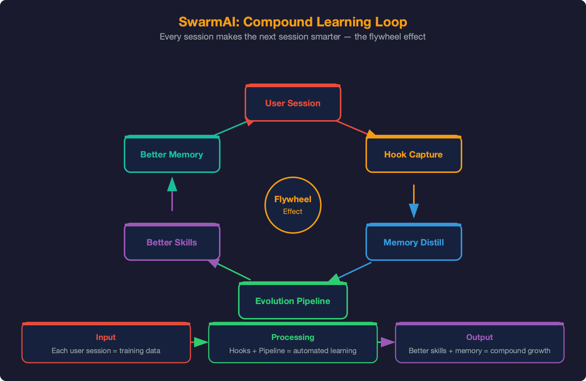

<!-- SOURCE OF TRUTH HIERARCHY:
  1. This .md file = canonical content (edit this)
  2. generate-arch-doc.py = HTML template + PDF generator (mirrors this .md)
  3. SwarmAI-Architecture-Design-Doc.pdf = generated output (never edit directly)
  4. TECH.md = DDD summary (shorter, cross-references this doc for details)
  
  When updating: edit this .md → sync changes to generate-arch-doc.py HTML → run generator → PDF updates.
  SVG diagrams are shared by both .md (image refs) and .py (inline embeds).
-->

# SWARMAI — Agentic OS Architecture

## High-Level Design Document

**Harness Engineering: How a Stateless LLM Becomes a Persistent, Evolving Agent**

| Feature | Description |
|---------|-------------|
| **6 Architecture Layers** | Interface → Intelligence → Harness → Session → Engine → Platform |
| **11-File Context Chain** | P0–P10 priority system with token budgets and L0/L1 caching |
| **3-Layer Memory Pipeline** | Session capture → distillation → curated long-term memory (git-verified) |
| **Hybrid Memory Recall** | FTS5 keyword + sqlite-vec vector search (Bedrock Titan v2 embeddings) |
| **61 Skills (15 always + 46 lazy)** | Two-tier loading with manifest.yaml — 49% token reduction in skill listing |
| **4-Phase Evolution Pipeline** | MINE → ASSESS → ACT → AUDIT with confidence-gated deployment |
| **8-Stage Autonomous Pipeline** | EVALUATE → THINK → PLAN → BUILD → REVIEW → TEST → DELIVER → REFLECT |
| **Daemon-First Backend** | launchd daemon runs 24/7 — desktop app is optional UI layer |
| **OOM Resilience** | Proactive RSS-based restart at 1.8GB — prevents macOS jetsam kills |
| **Multi-Channel Unified Brain** | Desktop + Slack — same agent, same memory, same context |

Version: 2.1 • Date: April 15, 2026
Author: Xiaogang Wang (XG) + Swarm (AI Co-Architect)
Status: For PE / Tech Leadership Review • Classification: Internal

---

## Table of Contents

1. [Executive Summary](#1-executive-summary)
2. [Architecture Overview](#2-architecture-overview)
   - 2.1 Six-Layer Architecture • 2.2 The Compound Loop
3. [Core Engine & Growth Trajectory](#3-core-engine--growth-trajectory)
4. [The Harness — Core Innovation](#4-the-harness--core-innovation)
   - 4.1 Context Engineering • 4.2 Memory Pipeline `UPDATED` • 4.3 Self-Evolution — Next-Gen Agent Intelligence `UPDATED` • 4.4 Safety & Self-Harness
5. [Swarm Brain — Multi-Channel Architecture](#5-swarm-brain--multi-channel-architecture) `UPDATED`
6. [Session Architecture & Multi-Tab Parallel Sessions](#6-session-architecture--multi-tab-parallel-sessions)
7. [Intelligence Layer](#7-intelligence-layer)
   - 7.1 Autonomous Pipeline • 7.2 Job System • 7.3 Proactive Intelligence
8. [Three-Column Command Center](#8-three-column-command-center)
9. [Daemon-First Backend](#9-daemon-first-backend) `NEW`
10. [OOM Resilience & Proactive Restart](#10-oom-resilience--proactive-restart) `NEW`
11. [Key Design Decisions & Tradeoffs](#11-key-design-decisions--tradeoffs) `UPDATED`
12. [Competitive Positioning](#12-competitive-positioning)
13. [Future Roadmap](#13-future-roadmap) `UPDATED`

---

## 1. Executive Summary

SwarmAI is a desktop application that wraps Claude's Agent SDK inside a harness — a structured layer of context management, persistent memory, self-evolution, and safety controls that transforms a stateless large language model into a persistent, evolving personal AI agent.

The core thesis: most AI tools reset when you close them. Context is lost, decisions are forgotten, and users re-explain the same things session after session. SwarmAI solves this structurally — not through fine-tuning, but through engineered knowledge persistence.

> **Key Innovation:** The "Harness" — an 11-file context priority chain, 3-layer memory distillation pipeline with hybrid vector+keyword recall, self-evolution registry, and 7 post-session hooks that create a compound loop: every session makes the next one better. Every correction prevents a class of future mistakes.

### Key Metrics (April 2026)

| Metric | Value |
|--------|-------|
| Commits | 838+ |
| Built-in Skills | 61 (15 always-loaded, 46 lazy-loaded via manifest.yaml) |
| Context Files | 11 (P0–P10 priority chain) |
| Post-Session Hooks | 8 (auto-commit, DailyActivity, distillation, evolution ×2, context-health, improvement, user-observer) |
| Pipeline Stages | 8 (EVALUATE → REFLECT) |
| Session States | 5 (COLD → STREAMING → IDLE → WAITING_INPUT → DEAD) |
| Core Engine Level | L4 (Autonomous) — DDD auto-refresh + auto-skill proposals + hybrid recall |
| Backend Mode | Daemon-first (launchd 24/7) — desktop app is optional UI layer |
| OOM Protection | Proactive RSS restart at 1.8GB — prevents jetsam kills |
| Memory Recall | 4-level: Brain (always) + Library (vector+FTS5) + Transcripts (semantic) + Session (FTS5) |
| Evolution Pipeline | 4-phase MINE→ASSESS→ACT→AUDIT, confidence-gated deployment |
| Channels | Desktop + Slack (unified brain) |
| Tech Stack | 4 languages: Rust (Tauri), TypeScript (React), Python (FastAPI), SQL (SQLite) |

---

## 2. Architecture Overview

### 2.1 Six-Layer Architecture

SwarmAI's architecture is organized into six horizontal layers. Each layer has a clear responsibility boundary. The Harness layer (Layer 3) is the core innovation — it is what differentiates SwarmAI from a simple LLM wrapper.


*Figure 1: SwarmAI Agentic OS Architecture — Six-layer design with the Harness as the core innovation*

| Layer | What It Does | Key Components |
|-------|-------------|----------------|
| Interface | Visual workspace, multi-tab chat, dashboard, channels | SwarmWS Explorer, Chat (1–4 tabs), Radar, Gateway (Slack) |
| Intelligence | Proactive awareness, autonomous execution, jobs | Proactive Intelligence, Signal Pipeline, Autonomous Pipeline, Job System |
| Harness | Core: raw Claude → persistent, evolving agent | Context (11 files), Memory (3-layer + hybrid recall), Evolution (56+ skills), Safety |
| Session | Multi-session lifecycle, isolation, recovery | SessionRouter, SessionUnit (5-state), LifecycleManager, 7 Hooks |
| Engine | AI model access, tool ecosystem | Claude Agent SDK, Bedrock/Anthropic, MCP Servers (7+), Skills Engine |
| Platform | Desktop infra, all local, zero cloud | Tauri 2.0, React 19, FastAPI, SQLite, filesystem, launchd daemon (24/7) |

### 2.2 The Compound Loop

The defining characteristic is the compound loop — a feedback cycle where every session's output becomes the next session's input:



- **Session executes** — user interacts, decisions are made, code is written, files are created
- **Hooks fire** — 8 post-session hooks capture: DailyActivity, auto-commit, distillation, evolution ×2, context-health, improvement, user-observer
- **Memory updates** — DailyActivity accumulates; ≥3 unprocessed files trigger distillation promoting recurring themes to MEMORY.md
- **Context enriched** — next session's system prompt assembled from updated 11-file chain with latest memory and project context
- **Agent is smarter** — next session starts with full awareness of everything that happened and mistakes to avoid

> **Design Principle:** Prevention over recovery. The compound loop makes errors structurally impossible over time, not handled after they occur.

---

## 3. Core Engine & Growth Trajectory

The Swarm Core Engine is the meta-architecture that ties all six flywheels together. Each flywheel feeds the others: memory informs context, context improves sessions, sessions trigger evolution, evolution builds skills, skills improve memory capture — compound growth with every interaction.


*Figure 2: Swarm Core Engine — Six interconnected flywheels and growth trajectory (L4 Autonomous — current)*

| Flywheel | What It Does | Key Components |
|----------|-------------|----------------|
| Self-Evolution | Observes user patterns, measures skill performance, auto-optimizes underperformers, never repeats mistakes | EVOLUTION.md, 56+ skills, SkillMetrics, EvolutionOptimizer, SessionMiner, SkillFitness, UserObserver, SkillGuard |
| Self-Memory | 3-layer distillation + hybrid recall, SessionRecall (FTS5 cross-session search), MemoryGuard (all writes sanitized), git-verified, weekly LLM pruning | DailyActivity, distillation hooks, MEMORY.md, SessionRecall, MemoryGuard, briefing, sqlite-vec |
| Self-Context | 11-file P0-P10 priority chain + token budgets + caching | Context loader, prompt builder, budget tiers, freshness |
| Self-Harness | Validates context files, detects DDD staleness, auto-refresh | ContextHealthHook (light+deep), auto-commit, integrity |
| Self-Health | Monitors services, resources, sessions; proactive restart, auto-restart | Service manager, resource monitor, lifecycle manager, OOM governance |
| Self-Jobs | Background automation, scheduled tasks, signal pipeline | Job scheduler, service manager, signal fetch/digest |

### Growth Trajectory

| Level | State | Capabilities | Status |
|-------|-------|-------------|--------|
| L0 | Reactive | Responds to questions, no memory | Complete |
| L1 | Self-Maintaining | Remembers, self-commits, captures corrections, health monitoring | Complete |
| L2 | Self-Improving | Weekly LLM maintenance, unified jobs, feedback loops closed | Complete |
| L3 | Self-Governing | Session-type context, proactive gap detection, DDD auto-sync | Complete |
| L4 | Autonomous | **Next-Gen Agent Intelligence: 12-module self-evolution loop closed.** UserObserver → SkillMetrics → SessionMiner → EvolutionOptimizer → auto-deploy with backup. Plus DDD refresh, skill proposer, hybrid recall, MemoryGuard on all paths, proactive OOM restart. | Current (4/6 + 2 new) |

---

## 4. The Harness — Core Innovation

The Harness is what makes SwarmAI more than a ChatGPT wrapper. It is a structured engineering layer between the user interface and the raw LLM that provides four critical capabilities: context continuity, memory persistence, self-improvement, and safety.

### 4.1 Context Engineering

Most AI tools assemble a single system prompt. SwarmAI maintains an 11-file priority chain (P0–P10) that is assembled, cached, and budget-managed through a multi-stage pipeline. This is the most token-intensive subsystem and the one with the highest impact on agent quality.


*Figure 3: Context Engineering — 11-file priority chain with token budget management and L0/L1 caching*

#### Priority Chain

| P | File | Owner | Truncation | Purpose |
|---|------|-------|-----------|---------|
| P0 | SWARMAI.md | System | Never | Core identity & principles |
| P1 | IDENTITY.md | System | Never | Agent name, avatar, intro |
| P2 | SOUL.md | System | Never | Personality & tone |
| P3 | AGENT.md | System | Truncatable | Behavioral directives |
| P4 | USER.md | User | Truncatable | User preferences & background |
| P5 | STEERING.md | User | Truncatable | Session-level overrides |
| P6 | TOOLS.md | User | Truncatable | Tool & environment config |
| P7 | MEMORY.md | Agent | Head-trimmed | Persistent memory (newest kept) |
| P8 | EVOLUTION.md | Agent | Head-trimmed | Self-evolution registry |
| P9 | KNOWLEDGE.md | Auto | Truncatable | Domain knowledge index |
| P10 | PROJECTS.md | Auto | Lowest | Active projects index |

#### Key Design Decisions

- **Session-type-aware loading** — Channel DMs skip EVOLUTION.md, PROJECTS.md, DailyActivity (~30% token savings)
- **L0/L1 cache** — L1 uses git-first freshness; L0 is AI-summarized compact version for constrained models
- **Head-trimming** — MEMORY.md and EVOLUTION.md keep newest content; old entries trim from top
- **Token budget** — 100K tokens for 1M context models; priority truncation removes P10 first, never touches P0–P2
- **Resume context checkpoint** `NEW` — Structured ~600-token checkpoint (last request, files touched, git commits, agent spawns, tool activity) replaces 200K raw history dump for session recovery

### 4.2 Memory Pipeline `UPDATED`

The memory pipeline is now a two-part system: a **distillation pipeline** that converts raw session activity into durable, curated knowledge, and a **recall system** that ensures any memory entry — regardless of age — can be found when relevant.


*Figure 4: Memory Pipeline — Three-layer distillation + hybrid recall system with vector embeddings*

#### Distillation Pipeline

| Layer | Storage | Lifecycle | Content |
|-------|---------|-----------|---------|
| 1. Capture | DailyActivity/YYYY-MM-DD.md | 30 days → archived | Per-session: deliverables, git commits, decisions, lessons, next steps |
| 2. Distillation | Triggered when ≥3 files | At session start (silent) | Recurring themes promoted; noise filtered; claims verified against git log |
| 3. Curated | MEMORY.md | Permanent (weekly maint.) | Open Threads (P0/P1/P2), Key Decisions, Lessons, COE Registry |

#### Recall System (4-Level)

| Level | Type | Storage | Search | Injection |
|-------|------|---------|--------|-----------|
| L1: Semantic | "I know that..." | MEMORY.md (curated, ~5K tokens) | N/A — full injection | Always in system prompt |
| L2: Procedural | "I know how..." | EVOLUTION.md (corrections, competence) | N/A — full injection | Always in system prompt |
| L3: Episodic | "I experienced..." | Knowledge Library (270+ files, 730K+ tokens) | Hybrid: 0.6 vector + 0.4 FTS5 | Pre-session + post-first-message recall |
| L4: Verbatim | "The exact words..." | JSONL transcripts (1,500+ files, 700MB+) | Semantic vector + FTS5 | On-demand transcript search |

Three-stage recall activation: (1) Pre-session — focus keywords from proactive briefing. (2) Post-first-message — re-search with user's actual query (commit `3c9f0d4`). (3) Mid-session — agent-initiated Read tool. Score threshold <0.2 suppresses injection — empty recall beats wrong recall.

See **Memory Management Design Doc** for complete architecture (19 pages, 15 sections).

> **Design Principle:** "Power over token budget" — Token saving is NEVER the primary concern. Primary goal is always powerful function and maximum recall. Any memory entry, regardless of age, can be recalled when relevant.

#### Git Cross-Reference (Safety)

Born from a real Sev-2 incident (COE C005): the distillation hook verifies all implementation claims against `git log` before promoting to MEMORY.md. Without this, mid-session snapshots captured before later commits create false memories that compound across sessions.

### 4.3 Self-Evolution — Next-Gen Agent Intelligence

Self-evolution is a **closed-loop system** across 12 modules in 4 phases. The agent observes user behavior, measures skill performance, mines correction patterns from session transcripts, and automatically rewrites underperforming skills — all with safety gates and audit trails.


*Figure 5: Next-Gen Agent Intelligence — 12 modules across 4 phases forming a closed observe-measure-mine-optimize loop*

| Phase | Modules | Purpose |
|-------|---------|---------|
| **1: Safety** | MemoryGuard, SkillMetrics, SectionCaps, EntryRefs | Guard all MEMORY.md writes, measure skill performance, enforce memory size limits, cross-reference entries with 1-hop loading |
| **2: Understanding** | UserObserver, SessionRecall, SkillRegistry, SkillGuard | Detect user behavioral patterns → USER.md suggestions, FTS5 cross-session search, compact skill index in prompts, trust-level skill scanning at discovery time |
| **3: Evolution** | SessionMiner, SkillFitness, EvolutionOptimizer, RetentionPolicies | Mine transcripts for eval examples (1500 char actions), 3-signal fitness scoring (Jaccard + bigram + containment), correction-pattern rewriting with .bak backup + deploy + audit log, lifecycle archival (90d/365d/7d) |
| **4: E2E Hardening** | 12 fixes across 13 files | MemoryGuard on all write paths, wire dead ends, singleton caches, word-boundary recall, 1-hop ref loading |

**The evolution cycle** — 4-phase pipeline (MINE→ASSESS→ACT→AUDIT), 7-day cadence + Thursday cron:

```
MINE:    SessionMiner scans 1,500+ JSONL transcripts → per-skill eval examples
ASSESS:  SkillFitness scores → confidence: HIGH (>=0.7) | MED (0.3-0.7) | LOW (<0.3)
ACT:     HIGH → auto-deploy (.bak backup + verify + rollback)
         MED → surface recommendation in session briefing (Skill health section)
         LOW → log to skill_health.json only
AUDIT:   Verify deployment, rollback on failure, log to EVOLUTION.md
```

**Skill tiering** — 61 skills split into always-loaded (15, ~100 tokens each) and lazy-loaded (46, ~25-token stubs). Lazy skills read INSTRUCTIONS.md via agent Read tool on invocation. 49% token reduction. Complex skills declare scripts via `manifest.yaml`.

**Key design: confidence gating.** With ~6% correction rate, HIGH threshold is unreachable for most skills — the pipeline safely accumulates data until evidence justifies deployment. Observation is always safe; actuation is gated.

**EVOLUTION.md registry** tracks all system growth:

| Category | Lifecycle | Examples |
|----------|-----------|----------|
| Capabilities Built | Active → archived if 0 usage for 30d | Browser agent, context monitor, workspace finder |
| Optimizations | Permanent | Use CDP over WebSocket for persistent browser sessions |
| Corrections | Permanent (NEVER deleted) | Reported features as 'not started' when fully shipped (C005) |
| Competence | Cross-referenced | SSE streaming pipeline, multi-session architecture |
| Failed Evolutions | Permanent | Approaches attempted and abandoned (with reasons) |

> **Design Principle:** Corrections are the highest-value entries — proven failure modes with known patterns. Deleting a correction is equivalent to removing a safety guard. The registry is append-mostly; corrections are append-only.
>
> **Key lesson (2026-04-10):** 206 unit tests passed across all 3 phases, yet E2E review found 3 critical wiring gaps (MemoryGuard bypass on 4 write paths, UserObserver dead-end output, 178 lines of dead code). Unit tests prove components work; only E2E trace proves they're wired. Full design: `Next-Gen-Agent-Intelligence-Design-Doc.md`.

### 4.4 Safety & Self-Harness

Safety is a structural property, not a feature. SwarmAI implements defense-in-depth through seven independent layers:

| Layer | Mechanism | Details |
|-------|-----------|---------|
| Tool Logger | Audit trail | Every tool invocation logged with timestamp, parameters, result |
| Command Blocker | Pattern matching | 13 dangerous patterns blocked (rm -rf, DROP TABLE, force push, etc.) |
| Permission Dialog | Human approval | First-time external actions require approval; approvals persist |
| Bash Sandbox | Claude SDK sandbox | Filesystem write restrictions, network allowlists, process isolation |
| Escalation Protocol | Confidence-gated | 3 levels: INFORM (act+tell), CONSULT (options+ask), BLOCK (stop+wait) |
| ContextHealthHook | Integrity validation | Light (every session): file existence/format. Deep (weekly): staleness |
| Decision Classification | Judgment framework | mechanical (auto), taste (batch), judgment (block for human) |

---

## 5. Swarm Brain — Multi-Channel Architecture

Swarm is a personal assistant with one brain. Regardless of channel — desktop or Slack — it is the same Swarm, same memory, same context. Adding a new channel: write an adapter (~250 lines), register in gateway, map user identity. Zero architecture change.


*Figure 6: Swarm Brain — One AI, every channel, three layers of continuity*

| Layer | Mechanism | Scope |
|-------|-----------|-------|
| L1: Shared Memory | 11 context files loaded at every prompt build | All sessions (tabs + channels) |
| L2: Cross-Channel Session | All channels share ONE Claude conversation (--resume) | Slack + future channels |
| L3: Active Session Digest | Sibling session summaries injected into prompts | Tabs ↔ Channels (bidirectional) |

#### Key Design Decisions

- Chat tabs are parallel (multi-slot, per-topic) — for deep work
- Channel session is serialized (single dedicated slot) — for quick exchanges across platforms
- One dedicated channel slot always reserved (min_tabs = 2) — channels never starve chat, chat never starves channels
- User identity mapping ties platform IDs (Slack W017T04E) to one unified user_key

---

## 6. Session Architecture & Multi-Tab Parallel Sessions

Replaced a monolithic AgentManager (5,428 lines) with four focused components during the v7 re-architecture. Driven by real need: parallel chat tabs + dedicated channel slots without resource exhaustion.


*Figure 7: Multi-Tab Parallel Sessions — SessionRouter, 5-state SessionUnits, dedicated channel slot*

| Component | Responsibility |
|-----------|---------------|
| SessionRouter | Slot acquisition, IDLE eviction, queue timeout (60s), MAX_CONCURRENT=2 |
| SessionUnit | 5-state machine (COLD→STREAMING→IDLE→WAIT→DEAD), subprocess spawn, 3x retry with --resume, SSE |
| LifecycleManager | 60s health loop, 12hr TTL kill, DEAD→COLD cleanup, startup orphan reaper, **proactive RSS restart** |
| SessionRegistry | Module-level singletons, initialize() wires components, configure_hooks() |

#### Key Invariants

- Protected states (STREAMING, WAITING_INPUT) are never evicted
- Subprocess spawn serialized via module-level locks
- Retry uses `--resume` to restore conversation context across crashes
- Hooks fire via BackgroundHookExecutor — never block the request path
- One dedicated slot always reserved for channels (min_tabs = 2)
- **Proactive restart** `NEW`: when RSS exceeds 1.2GB, compact → kill → lazy resume (prevents jetsam OOM kills)

---

## 7. Intelligence Layer

The Intelligence layer provides proactive awareness, autonomous execution, and background automation. While the Harness ensures the agent remembers and improves, this layer ensures it anticipates, acts, and automates.

### 7.1 Autonomous Pipeline

Drives the full development lifecycle from a one-sentence requirement to PR-ready delivery. Implementation of AIDLC Phase 3 (AI-Management): AI makes autonomous decisions, humans step in when needed.


*Figure 8: Autonomous Pipeline — 8-stage lifecycle with DDD+SDD+TDD methodology and safety mechanisms*

| Stage | Output | Gate |
|-------|--------|------|
| EVALUATE | ROI score, GO/DEFER/REJECT | ROI ≥ 3.5 to proceed |
| THINK | 3 alternatives (Minimal/Ideal/Creative) | User picks approach |
| PLAN | Design doc (SDD) + acceptance criteria | Design approval |
| BUILD | Code + tests (TDD: RED → GREEN → VERIFY) | All tests pass |
| REVIEW | Code quality scan + security scan | No high-severity findings |
| TEST | Full suite, regression check | WTF Gate (halt if risky) |
| DELIVER | PR description, decision log, report | Taste decisions batched |
| REFLECT | Lessons → IMPROVEMENT.md | — |

Methodology Stack (DDD + SDD + TDD): DDD (4 project docs) provides autonomous judgment — "should we build this?". SDD (design doc with acceptance criteria) produces specs. TDD (tests before code) verifies delivery. Key insight: when no human reviews every line, the test suite IS the quality gate.

### 7.2 Job System

Background automation via macOS launchd — runs independently of chat sessions. The scheduler evaluates due jobs every hour, routes them to type-specific handlers via the executor, and persists state across restarts. The service manager handles long-running sidecars (Slack bot) with auto-restart and health monitoring.


*Figure 9: Job System — launchd scheduler, executor routing, signal pipeline, and sidecar services*

| Job Type | Handler | Examples | Token Cost |
|----------|---------|----------|------------|
| signal_fetch | httpx adapters (HN, RSS, GitHub) | 3x daily signal collection | Zero (no LLM) |
| signal_digest | Sonnet 4.6 relevance scoring | Daily digest, weekly rollup | ~2K tokens/run |
| agent | Headless Claude CLI + MCP | Morning inbox, custom tasks | Variable |
| script | Subprocess (deterministic) | self-tune, feed calibration | Zero (no LLM) |
| maintenance | Prune + cleanup + L4 proposals | Weekly cache cleanup, DDD refresh, skill proposer | ~$0.25/week |

System jobs (signal-fetch, signal-digest, self-tune, weekly-maintenance, weekly-rollup) are defined in code and read-only. User jobs live in `user-jobs.yaml` with full CRUD via job_manager.py.

### 7.3 Proactive Intelligence

1,142 lines, 106+ tests. Provides session-start briefings through five levels of analysis:

| Level | Capability | How |
|-------|-----------|-----|
| L0 | Parsing | Extract structured data from DailyActivity, MEMORY.md, open threads |
| L1 | Temporal awareness | Time-sensitive items, deadlines, recency weighting |
| L2 | Scoring engine | Priority × staleness × frequency × blocking × momentum per item |
| L3 | Cross-session learning | JSON-persisted: skip penalty for ignored, affinity bonus for accepted |
| L4 | Signal highlights | External intelligence (HN, RSS, GitHub) with effectiveness scoring |

---

## 8. Three-Column Command Center

The interface is a single integrated system where the Chat Center orchestrates everything. Three columns are views into one unified workspace connected by drag-to-chat context injection.


*Figure 10: Three-Column Command Center — SwarmWS, Chat Center, Swarm Radar with drag-to-chat*

| Column | Purpose | Key Interactions |
|--------|---------|-----------------|
| SwarmWS Explorer (left) | Persistent local workspace | Git-tracked + ETag polling. Agent reads/writes/commits directly. |
| Chat Center (center) | Multi-session command surface | SSE streaming, per-tab isolation, 56+ skills, MCP tools. Controls Explorer and Radar. |
| Swarm Radar (right) | Attention dashboard | ToDos, sessions, artifacts, jobs. Drag work packets to chat for instant context. |

---

## 9. Daemon-First Backend `NEW`

A fundamental architectural shift (March 30, 2026): **Tauri now connects to a launchd-managed daemon instead of spawning a sidecar.** The backend runs independently of the desktop app, enabling 24/7 operation for Slack, background jobs, and scheduled tasks.

### How It Works

| Step | What Happens | Detail |
|------|-------------|--------|
| 1. App Launch | Tauri probes for running daemon | Retry 5×2s at discovered port via psutil |
| 2. No Daemon? | Auto-bootstrap via launchctl | `launchctl bootstrap gui/<uid> com.swarmai.backend.plist` |
| 3. Still No? | Fallback: spawn as sidecar | Legacy mode — same as v1.0, but rare |
| 4. App Closes | Daemon stays alive | Slack, jobs, signals continue 24/7 |
| 5. Crash Recovery | launchd auto-restarts | KeepAlive=true, max 3 retries, exit 37 for bootstrap conflict |

### Key Benefits

- **Always-on Slack** — Slack bot stays connected when app is closed. No missed messages.
- **Background jobs run 24/7** — Morning inbox, signal fetching, self-tune all execute on schedule without the desktop app.
- **Instant app startup** — No cold-start delay; backend is already warm.
- **Crash resilience** — launchd auto-restarts the daemon; desktop app reconnects seamlessly.

> **Architecture Insight:** The desktop app is now an **optional UI layer**, not the system's brain. SwarmAI's intelligence lives in the daemon — the app just visualizes it.

---

## 10. OOM Resilience & Proactive Restart `NEW`

macOS jetsam kills processes that exceed memory pressure thresholds — with no warning, no cleanup, no resume. SwarmAI now **proactively** restarts sessions before jetsam acts, preserving conversation context.

### The Problem

Each Claude CLI subprocess + its MCP servers costs ~500MB RSS. Two active tabs = ~1GB. With context growth during long sessions, processes can reach 1.2-1.5GB, triggering jetsam exit code -9 kills. Previously: total data loss for that session.

### The Solution: Proactive Restart-with-Resume

| Component | What | Detail |
|-----------|------|--------|
| Trigger B (primary) | Post-turn RSS check | After STREAMING → IDLE, check process tree RSS. If > 1.8GB: trigger restart. |
| Trigger A (fallback) | Lifecycle maintenance loop | Every 60s, check all IDLE sessions. Catches sessions that grew but received no new messages. |
| Restart Flow | Compact → kill → lazy resume | Trigger SDK compaction, kill subprocess, mark COLD. Next message auto-respawns with `--resume`. |
| Cooldown | 3-minute per-session cooldown | Prevents restart loops. OOM crash adds 30-120s backoff. |
| Auto-resume | `_ensure_spawned` always checks | If COLD + existing `_sdk_session_id` → auto-inject `--resume`. Covers ALL kill-then-respawn paths. |

### Resource Monitoring

- **Effective memory**: `total - available` (matches macOS jetsam logic, NOT `psutil.virtual_memory().used`)
- **Pressure levels**: ok (<80%) | warning (80-90%) | critical (≥90%)
- **Spawn budget**: Dynamic tab limit from available RAM — prevents overcommit

> **Design Principle:** "Prevent, don't handle." Proactive restart *prevents* jetsam kills structurally — it doesn't try to recover after the fact. The best error handler is the one that never fires.

---

## 11. Key Design Decisions & Tradeoffs

| Decision | Choice | Alternative | Rationale |
|----------|--------|------------|-----------|
| Memory | 3-layer distillation + hybrid recall (files + vector) | Pure RAG / Vector DB | Files are git-trackable, human-readable, editable. Vector adds semantic recall without replacing files. |
| Sessions | 4-component decomposition | Monolithic AgentManager | 5,428-line God Object caused 15+ bugs (COE). Clean error boundaries. |
| Context | 11-file priority chain + budget | Single system prompt | Priority truncation ensures identity/safety survive under pressure |
| Channels | Shared session (serialized) | Independent per channel | 'One brain': Slack knows what desktop said. No fragmentation. |
| Skills | SKILL.md instruction files | Compiled plugins | LLM-native: agent reads as natural language. New skill = markdown file. |
| Data | All local (SQLite + filesystem) | Cloud database | Zero cloud dependency. Privacy by default. Works offline. |
| Safety | Defense-in-depth (7 layers) | Single permission gate | No single layer sufficient. Redundant protection. |
| Jobs | macOS launchd daemon | In-process cron | Survives app restarts, runs when app is closed, managed by OS. |
| Backend | Daemon-first (launchd) | App-managed sidecar | 24/7 operation: Slack, jobs, signals run without desktop app. |
| OOM | Proactive RSS restart | Reactive crash recovery | Prevention > recovery. Jetsam kills lose all context; proactive restart preserves it. |
| Agents | Single-agent role-switching | Multi-agent orchestration | Zero context transfer cost. Multi-agent coordination is a tax on limited cognition. |

---

## 12. Competitive Positioning

SwarmAI occupies a unique position: not a code editor, not an IDE, not a CLI agent, not a multi-platform connector. It is an agentic operating system optimizing for depth over breadth.

| Capability | SwarmAI | Claude Code | Kiro | Cursor | OpenClaw |
|-----------|---------|-------------|------|--------|----------|
| Memory | 3-layer + hybrid vector recall | CLAUDE.md (manual) | Per-project | Per-project | Session pruning |
| Context | 11-file + budgets | Single prompt | Spec-driven | Codebase index | Standard |
| Multi-session | 1-4 parallel tabs | 1 session | 1 session | 1 session | Per-channel |
| Self-evolution | 61 skills + 4-phase evolution pipeline | No | No | No | No |
| Autonomous pipeline | 8-stage + DDD+TDD | Manual | Spec-driven | No | No |
| Multi-channel | Unified brain | Terminal | IDE only | IDE only | 21+ (isolated) |
| Scope | All knowledge work | Coding | Coding | Coding | Messaging |
| OOM protection | Proactive RSS restart | No | No | No | No |
| Always-on | launchd daemon 24/7 | No | No | No | Per-channel |

> **Core Differentiator:** The Harness. No competitor provides the compound loop of context engineering + memory distillation with hybrid recall + self-evolution + safety harness that makes an AI agent genuinely improve over time.

---

## 13. Future Roadmap

| Phase | Target | Key Deliverables |
|-------|--------|-----------------|
| DSPy/GEPA Optimizer | When eval data sufficient | ML-grade skill optimization layered on heuristic interface (>20 examples/skill) |
| MCP Gateway | When SDK supports | Shared MCP instances across sessions (~2.8GB → ~700MB) |
| Multi-User | Q4 2026 | Team workspace, role-based access, collaborative memory |
| Cross-Platform | Q4 2026 | Linux support (launchd → systemd for background jobs) |

---

**Document History:**
- v2.1 (April 15, 2026) — Updated: 4-level memory recall, Evolution Pipeline v2 (MINE→ASSESS→ACT→AUDIT), lazy/always skill tiering (61 skills), OOM threshold 1.8GB, 838+ commits, signal fetcher service resolved.
- v2.0 (April 8, 2026) — Major refresh: Daemon-first backend, OOM resilience, hybrid memory recall, updated metrics & competitive positioning.
- v1.0 (March 26, 2026) — Initial release for PE/Tech Leadership review.

Generated by: Swarm (Claude Opus 4.6) under supervision of Xiaogang Wang (XG).
Repository: github.com/xg-gh-25/SwarmAI
